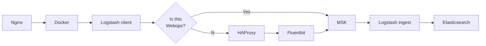

# can-hedgehogs-fly

nothing interesting here, just testing in-line mermaid.





```mermaid
  graph LR;
      subgraph MSK
          subgraph Broker_1
              P1[Logs Topic<br/>Part 1];
           end
          subgraph Broker_2
              P2[Logs Topic<br/>Part 2];
           end
          subgraph Broker_3
              P3[Logs Topic<br/>Part 3];
           end
       end
       Logstash-->Q{Is this<br/>Webops}
       Q-->Yes((Yes));
       Yes-->Q2<Is this<br/>Legacy?>;
       Q2-->Yes2((Yes));
       Q2-->No2((No));
       No2-->P1;
       No2-->P2;
       N02-->P3;
       Yes2-->Redis-->Ingest;
       Ingest-->P1;
       Ingest-->P2;
       Ingest-->P3;
       Yes-->P1;
       Yes-->P2;
       Yes-->P3;
       Q-->No((No));
       No-->HAProxy-->Fluentbit;
       Fluentbit-->P1;
       Fluentbit-->P2;
       Fluentbit-->P3;
```
