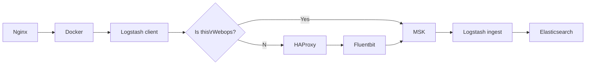

# can-hedgehogs-fly

nothing interesting here, just testing in-line mermaid.

```mermaid
  graph LR;
      Nginx-->Docker-->LC[Logstash client]
      LC-->E{Is this\rWebops?}--Yes-->MSK;
      E--No-->HAProxy-->Fluentbit-->MSK;
      MSK-->LI[Logstash ingest]--> Elasticsearch;
```
